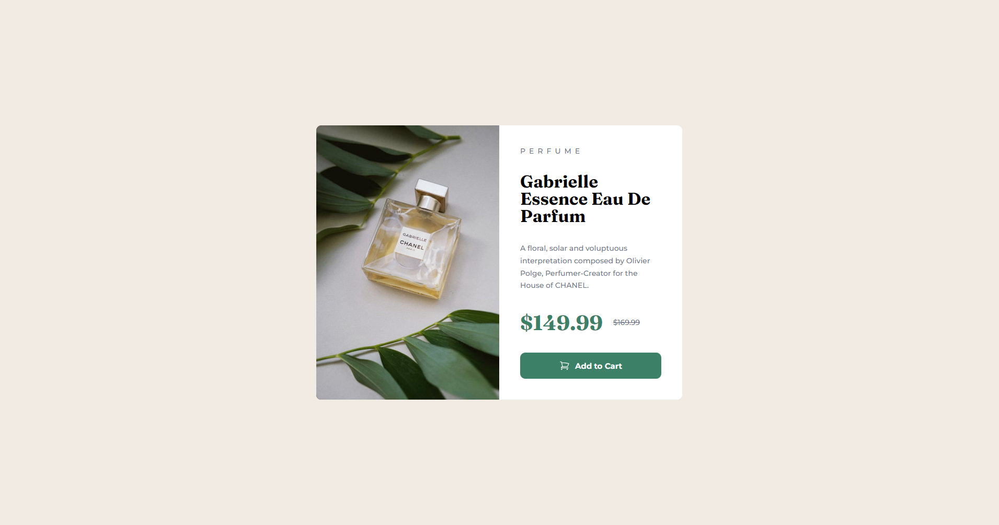

# Frontend Mentor - Product preview card component solution

This is a solution to the [Product preview card component challenge on Frontend Mentor](https://www.frontendmentor.io/challenges/product-preview-card-component-GO7UmttRfa). Frontend Mentor challenges help you improve your coding skills by building realistic projects.

## Table of contents

- [Overview](#overview)
  - [The challenge](#the-challenge)
  - [Screenshot](#screenshot)
  - [Links](#links)
- [My process](#my-process)
  - [Built with](#built-with)
  - [What I learned](#what-i-learned)
- [Author](#author)

**Note: Delete this note and update the table of contents based on what sections you keep.**

## Overview

### The challenge

Users should be able to:

- View the optimal layout depending on their device's screen size
- See hover and focus states for interactive elements

### Screenshot

### Links

- Frontendmentor URL: [https://www.frontendmentor.io/solutions/product-preview-card-component-html-and-css-flexbox-and-grid-mO4UnpgZcz](https://www.frontendmentor.io/solutions/product-preview-card-component-html-and-css-flexbox-and-grid-mO4UnpgZcz)
- Live Site URL: [https://stunning-piroshki-067ba6.netlify.app/](https://stunning-piroshki-067ba6.netlify.app/)

## My process

### Built with

- Semantic HTML5 markup
- CSS custom properties
- Flexbox
- CSS Grid

### What I learned

After a long time, I just started on projects. I also started with JavaScript, but I felt I needed to practice HTML and CSS before I started something big. I did not regret the decision. This small project also made me realize that I should not rush, and practicing is the best way to really keep the knowledge I have already gained.

## Author

- Frontend Mentor - [@cleshy](https://www.frontendmentor.io/profile/Cleshy)
- Github - [@cleshy](https://github.com/Cleshy)
